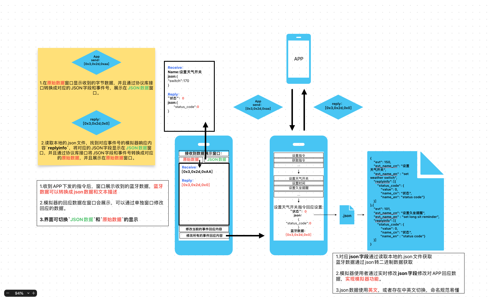

# {IDO模拟器事件字段说明}

## 1.功能概述

模拟器外部通过`json`将对应基础事件的字段输入，设置对应的基础事件的模拟器回应内容。

这个文件描述**对应基础事件的有效的`json`字段**及输入`json`字段后应该转换得到的**字节数据**内容。

以下描述中的`APP下发的json内容`为发送端，`APP收到的json字段`为模拟器回复APP的内容，为APP预想接收的内容。

## 2.基础事件

| **[V2设置指令事件](./IDOV2SetEvt/IDOSetEvtIntroduction.md)** |
| :----------------------------------------------------------- |
| **[V2获取指令事件](./IDOV2GetEvt/IDOGetEvtIntroduction.md)** |
| **[V3长包指令事件](./IDOV3Evt/IDOV3EvtIntroduction.md)**     |
| **[OTA指令事件](./IDOOtaEvt/IDOOtaEvtIntroduction.md)**      |
| **[APP发起通知/控制事件](./IDOControlEvt/IDOControlEvtIntroduction.md)** |
| **[设备主动通知/控制事件](./IDODeviceControlEvt/IDODeviceControlEvtIntroduction.md)** |
| **[ALEXA事件](./IDOAlexaEvt/IDOAlexaEvtIntroduction.md)**////TODO |
| **[V2多运动交互事件](./IDOSportSwitchEvt/IDOSportSwitchEvtIntroduction.md)**////TODO |
| **[V2同步健康数据事件](./IDOV2HealthSyncEvt/IDOV2HealthSyncEvtIntroduction.md)**////TODO |
| **[V3同步健康数据事件](./IDOV3HealthSyncEvt/IDOV3HealthSyncEvtIntroduction.md)**////TODO |

